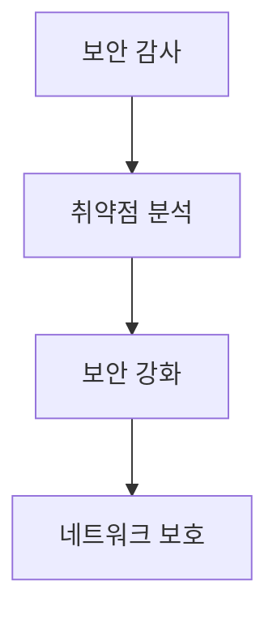

# 🔒 WiFi Network Security Testing Tool

<div align="center">


[](https://www.espressif.com/)

> ⚠️ ESP8266 기반 전문 네트워크 보안 분석 및 테스트 도구

</div>

---

## 📋 목차

-   [개요](#-개요)
-   [주의사항](#️-주의사항)
-   [기능](#-기능)
-   [설치 방법](#-설치-방법)
-   [사용 가이드](#-사용-가이드)
-   [법적 고려사항](#️-법적-고려사항)
-   [FAQ](#-faq)
-   [참고 자료](#-참고-자료)

---

## 📖 개요

이 도구는 전문 보안 감사 및 취약점 분석을 위한 ESP8266 기반 네트워크 보안 테스트 프로젝트입니다.

### 사용 목적



## ⚠️ 주의사항

### 법적 요구사항

-   ✅ 명시적 허가 필수
-   📚 교육/연구 목적 한정

### 윤리적 가이드라인

| 준수사항    | 설명                        |
| ----------- | --------------------------- |
| 사전 승인   | 네트워크 소유자의 서면 허가 |
| 범위 제한   | 승인된 대상만 테스트        |
| 데이터 보호 | 수집 정보의 안전한 관리     |
| 결과 보고   | 발견된 취약점 문서화        |

## ✨ 기능

### 핵심 기능

-   🔍 네트워크 분석
    -   SSID/BSSID 스캔
    -   신호 강도 측정
    -   채널 모니터링
-   🛡️ 보안 테스트
    -   인증 메커니즘 분석
    -   프로토콜 취약점 검사
    -   보안 설정 검증

### 기술 스펙

```yaml
하드웨어:
    프로세서: ESP8266
    주파수: 80MHz/160MHz
    메모리: 80KB DRAM

소프트웨어:
    플랫폼: Arduino
    언어: C++
    프로토콜: 802.11 b/g/n
```

## 🚀 설치 방법

### 1. 환경 구성

```bash
# 1. Arduino IDE 설치
# Windows/macOS: arduino.cc 에서 다운로드
# Linux:
sudo apt-get install arduino

# 2. ESP8266 보드 매니저 URL 추가
http://arduino.esp8266.com/stable/package_esp8266com_index.json
```

## ⚖️ 법적 고려사항

### 필수 준수사항

1. **사용 전 확인**

    - 네트워크 소유자의 서면 허가
    - 테스트 범위 명시
    - 시간대 지정

2. **법적 제한**

    - 무단 접근 금지
    - 데이터 수집 제한
    - 결과 보안 유지

3. **문서화 요구사항**
    - 테스트 계획 수립
    - 진행 과정 기록
    - 결과 보고서 작성

## 💭 FAQ

**Q: 이 도구는 합법적인가요?**

-   A: 승인된 보안 테스트 목적으로만 사용 시 합법

**Q: 필요한 기술 수준은?**

-   A: 네트워크 보안 기초 지식 필수

**Q: 실제 환경에서 사용 가능한가요?**

-   A: 테스트 환경에서만 권장

## 📚 참고 자료

### 공식 문서

-   [ESP8266 Technical Reference](https://www.espressif.com/sites/default/files/documentation/esp8266-technical_reference_en.pdf)
-   [Arduino ESP8266 Documentation](https://arduino-esp8266.readthedocs.io/)

### 커뮤니티 자료

-   [ESP8266 Deauther by SpacehuhnTech](https://github.com/SpacehuhnTech/esp8266_deauther)
-   [ESP8266 Security Projects](https://github.com/topics/esp8266-security)
-   [WiFi Security Best Practices](https://www.wi-fi.org/security)

---

<div align="center">

**[맨 위로 올라가기](#-wifi-network-security-testing-tool)**

⚠️ **교육 및 연구 목적으로만 사용하세요** ⚠️

</div>
